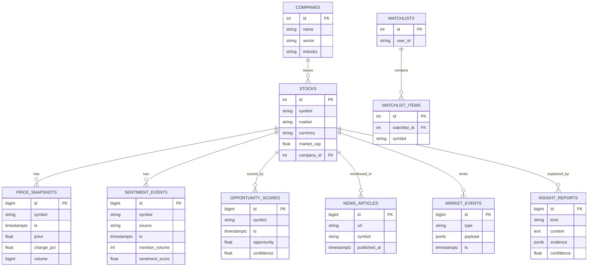

# Database Design

DDL: [`db/schema.sql`](../db/schema.sql) · ORM: `backend/app/models/entities.py`

## ER diagram

## Entity rationale
| Entity | Purpose | Notes |
|--------|---------|-------|
| companies / stocks | Reference data; a company may list in multiple markets | `UNIQUE(symbol, market)` |
| price_snapshots | Append-only price/volume series | drives candles, momentum, history |
| news_articles | Deduped headlines | `UNIQUE(url)` prevents re-ingest |
| sentiment_events | Per-source social metrics over time | source ∈ reddit/twitter/trends |
| sector_snapshots | Aggregated sector momentum/flow | powers rotation dashboard |
| opportunity_scores | Materialised score history | back-testable, audit trail |
| market_events | Unusual activity / earnings / breaking | also streamed via Redis |
| insight_reports | AI outputs WITH evidence + confidence | traceability requirement |
| watchlists / items | User-curated symbols | stub `user_id` until auth |

## Indexing strategy
- Every time series carries a composite `(symbol, ts DESC)` index → O(log n)
  "latest value" and range scans, the two access patterns we actually issue.
- `opportunity_scores` additionally indexes `(ts DESC, opportunity DESC)` so the
  homepage "top opportunities right now" is an index-only top-N.
- `news_articles(published_at DESC)` for the global news rail; `UNIQUE(url)` for
  idempotent ingestion.
- `market_events(ts DESC)`, `(type)`, `(symbol)` for the activity feed filters.

## Hot vs cold reads
Latest values are served from **Redis** (TTL = refresh cadence); Postgres is the
system of record for history, analytics and back-testing. This keeps p99 read
latency low and protects the DB from dashboard polling storms.

## Scaling path
1. Partition / hypertable the four `*_snapshots`/`*_events` tables by month
   (`SELECT create_hypertable('price_snapshots','ts')`).
2. Add continuous aggregates for sector/score rollups.
3. Move cold partitions to cheaper storage; retain ~13 months hot.
